# NodeJS SDK Walkthrough for PowerBI Embedded

<br/>

## **Introduction:**

PowerBI Embedded (PBIE) is the latest PaaS offering in Microsoft Azure that helps you embed impactful and interactive charts and reports into your web applications. It uses PowerBI Desktop as its authoring tool. PowerBI Embedded offers APIs in .NET, NodeJS and a RESTful API to upload charts and interact with your PowerBI embedded accounts in Microsoft Azure. In this document, we will be showcasing how to work with PowerBI Embedded using the NodeJS SDK. 

You have <u>**two**</u> options to help familirize yourself with this sample:
- Download the sample as is and run it in your own environment by following the [Setup](#setup) section

OR
- Start from scratch and follow the [Guide](#guide) section to setup the sample on your machine.

<br/>

## **Pre-Requisites:**

- [PowerBI Desktop](https://www.microsoft.com/en-us/download/details.aspx?id=45331)
- [A Microsoft Azure Subscription](https://azure.microsoft.com/en-us/free/)
- [Node.JS](https://nodejs.org/en/download/)

<br/>

## **[Setup](#setup)**

1. Ensure you have the pre-requisites installed. Clone or download this repository. You can also choose to just download the **PBIE_NodeJS** folder.

1. Open the **app.js** file found in the **pbie_sample** folder and replace the values for your SQL Azure Database. Save and close once done.
	>**NOTE**: If you do not plan to use AdventureWorksDB, you would even need to change the Passport authentication code in this sample application or remove the Row-level Security feature all-together. Refer to the [NodeJS Sample Application](#nodejs-sample-app) section for more details.
	
	```JavaScript
	var config = {
	userName: '<username>',
	password: '<password>',
	server: '<AzureSQLServer>.database.windows.net',
	options: {encrypt: true, database: 'AdventureWorksSampleDB', rowCollectionOnRequestCompletion: true}
	};
	```
1. Open the **routes/index.js** file found in the **pbie_sample** folder and replace the values for your Power BI Embedded details. Save and close once done.
	```JavaScript
	var workspaceCollection = "<workspace collection name>";
	var appKey = "<power bi embedded app key>";
	var workspaceId = "<PBIE workspace ID>";
	var reportId = "<PBIE Report ID>";
	```

1. Visit the [Demo](#demo) section to understand how to navigate the web application.

<br/>

## **[Guide](#guide)**

### **[Index](#index)**
 1. [Create a Workspace Collection](#workspace-collection)
 1. [Installing the Power BI Embedded Node.JS SDK](#pbie-nodejs-sdk)
 1. [Setting up the Data Source](#data-source)
 1. [Connecting PowerBI Desktop to your Data Source](#connect-data)
 1. [Authoring Your PowerBI Report](#author-pbi)
 1. [Adding Row-Level Security to the Power BI Report](#pbie-rls)
 1. [Uploading Your Report to your PBIE Workspace](#upload-report)
 1. [NodeJS Sample Application](#nodejs-sample-app)
 1. [Demo](#demo)

<br/>

1. ###  **<a id='workspace-collection'>Create a Workspace Collection</a>**

   Please follow the steps highlighted in this walkthrough: [https://azure.microsoft.com/en-us/documentation/articles/power-bi-embedded-get-started/#create-a-workspace-collection](https://azure.microsoft.com/en-us/documentation/articles/power-bi-embedded-get-started/#create-a-workspace-collection)
<br/><br/><br/>

1. ###  **<a id='pbie-nodejs-sdk'>Installing the Power BI Embedded Node.JS SDK</a>**

   PowerBI Node.JS SDK is available for download via github. The repository can be found [here](https://github.com/Microsoft/PowerBI-Node). The Node API works well in conjunction with the Node.JS command line interface, the code for which can be found [here](https://github.com/Microsoft/PowerBI-Cli).

     1. Open a command line interface and type &#39;**npm –v**&#39; to get started. You should get the same response as follows. If you do not, you need to re-install Node.JS.

        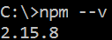

     1. Next, let&#39;s install the PowerBI Node API, by typing the following command &#39;**npm install powerbi-api**&#39;:

        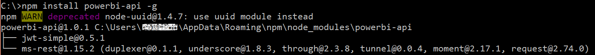

     1. Install the PowerBI CLI, by typing the following command &#39;**npm install powerbi-cli -g**&#39;:

        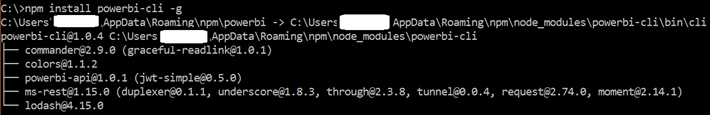
<br/><br/><br/>

1. ###  **<a id='data-source'>Setting up the Data Source</a>**

    For the purposes of this lab, we will be using the AdventureWorks Database to highlight the use of direct query in our PowerBI Embedded application.

    Please follow this blog post for instructions on how to setup the AdventureWorks sample database on Microsoft Azure SQL Database: [https://blogs.msdn.microsoft.com/kaevans/2015/03/06/adventure-works-for-azure-sql-database/](https://blogs.msdn.microsoft.com/kaevans/2015/03/06/adventure-works-for-azure-sql-database/)
<br/><br/><br/>

1. ###  **<a id='connect-data'>Connecting PowerBI Desktop to your Data Source </a>**

    The authoring experience is something that the SaaS version of PowerBI (Powerbi.com) and PowerBI embedded share. Before we can embed our reports into our web apps, let&#39;s author a simple report to embed.

     1. Open the PowerBI Desktop tool on your machine

     1. Click on &#39;**Get Data**&#39; found in the top ribbon under the &#39;Home&#39; tab.

        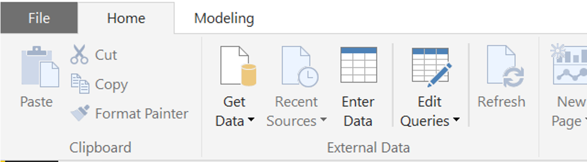

     1. Click on &#39;**Azure**&#39; in the left pane and then double click on &#39;**Microsoft Azure SQL Database**&#39;.

        

     1. Enter your server information along with your database name. Be sure to choose &#39;**Direct Query**&#39; and then click **OK**.

        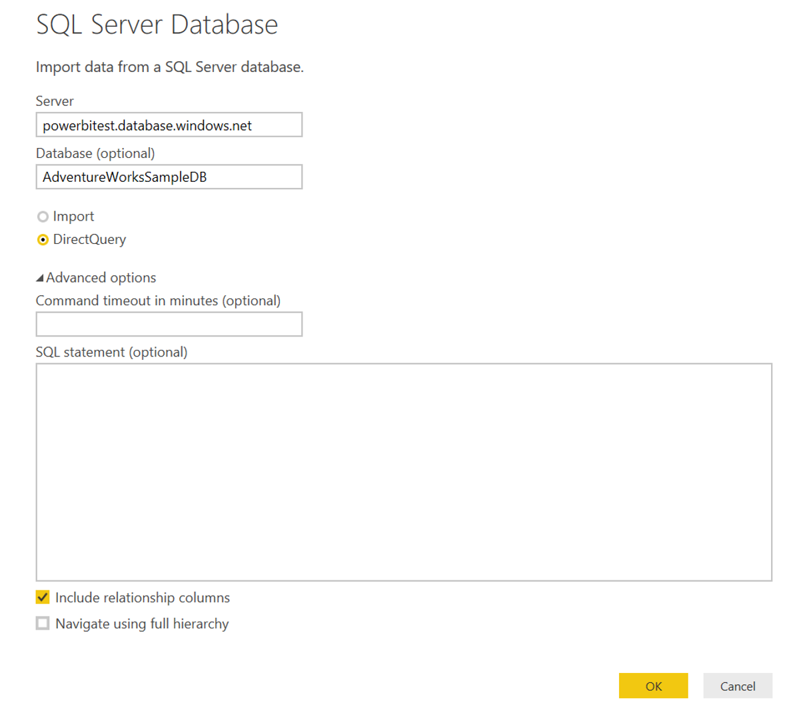

     1. Once prompted for the credentials, click on &#39;**Database**&#39; on the left pane. Enter your username and password and click &#39;**Connect**&#39;.

        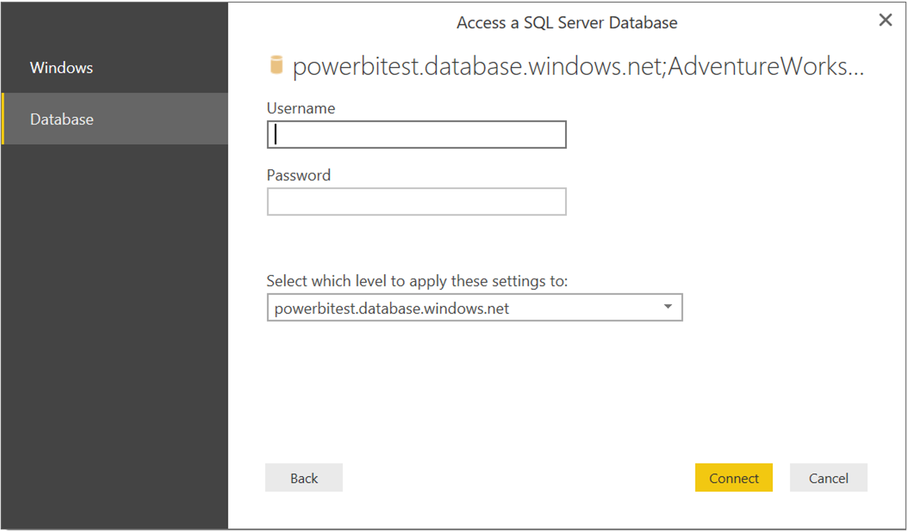

     1. Choose the following tables from the list of tables

        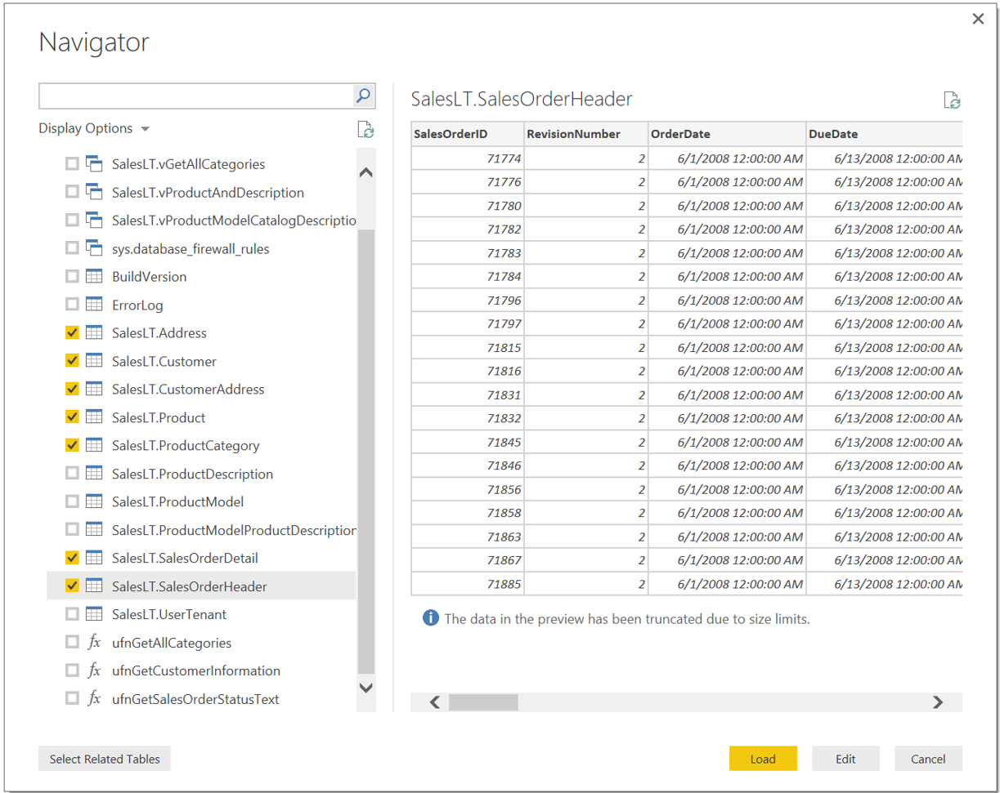

     1. You might get prompted again to pick between DirectQuery and Import. Be sure to pick &#39;**Direct Query**&#39;.

        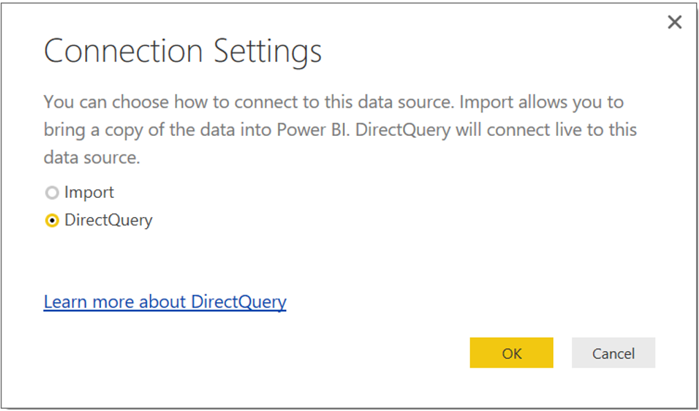

     1. PowerBI Desktop will now start pulling your tables into the canvas for you to work with the data. To verify that the data has loaded, checked the right pane to make sure you can see the table names and drill into each table to ensure that the column names have loaded.

        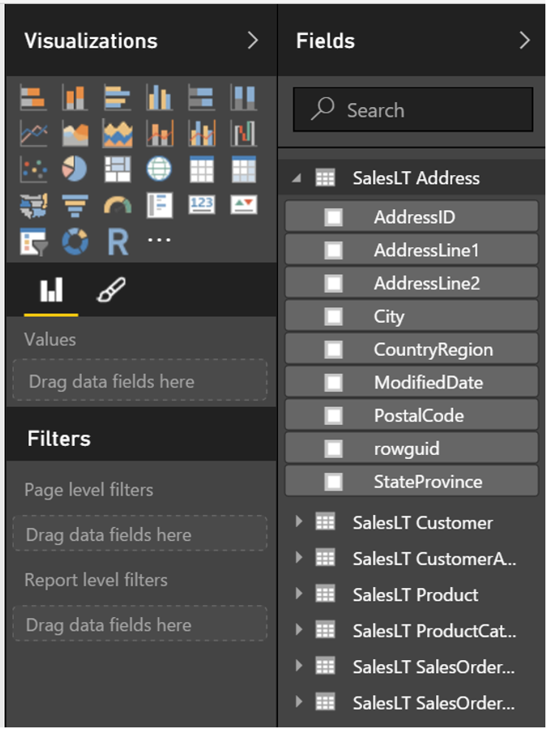

     1. Ensure that the data source relationships were loaded as well. In order to do this, click on the relationships icon in the left pane

        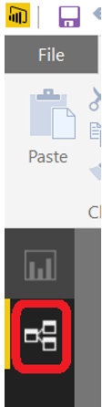

     1. You should see the relationships between the tables, like this.

        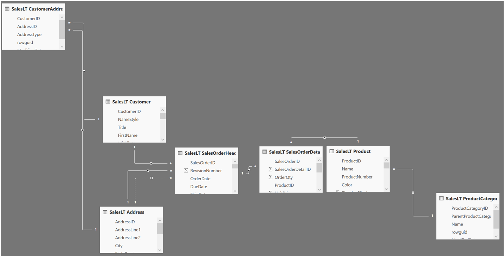

    You are now ready to author your reports.
<br/><br/><br/>

1. ###  **<a id='author-pbi'>Authoring Your PowerBI Report</a>**

     Now Head back to the canvas by clicking on the &#39;Report&#39; icon on the left pane.

     
<br/><br/>
     1. _**Chart showcasing Total Amount Spent Till Date**_

         1. From the right pane, scroll to the &#39;**SalesOrderDetail**&#39; table and click the checkmark next to the &#39;**LineTotal**&#39; field.

            

         1. At this point, select the &#39;**Card**&#39; visualization from the list, as shown below.

            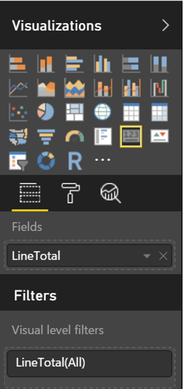

         1. You should see your card appear on your canvas. Finally, re-size the card and click on the Format section to add a title to the card. An optional step would be to be to rename the &#39;LineTotal&#39; to something more meaningful in the card (this can be done by creating a new column in Power BI Desktop).

            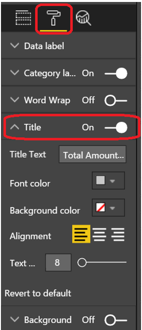

         1. Your card should look as follows:

            
<br/><br/>
     1. _**Chart showcasing Top Sold Products**_

         1. From the right pane, scroll to the &#39;**SalesOrderDetail**&#39; table and click the checkmark next to the &#39;**LineTotal**&#39; field.

 		    

	     1. Next, scroll to the &#39;**Product**&#39; Table and select the &#39;**Name**&#39; field

 		    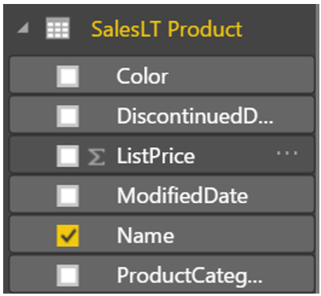

	     1. At this point, select the &#39;**Treemap**&#39; visualization from the list, as shown below.

		    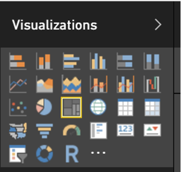

         1. Ensure that &#39;**Name**&#39; is placed under the &#39;**Group**&#39; section, while &#39;**LineTotal**&#39; is under the &#39;**Values**&#39; section.

  	        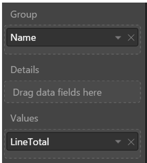

         1. You should see your Treemap appear on your canvas. An optional step would be to rename the chart title as well.

         	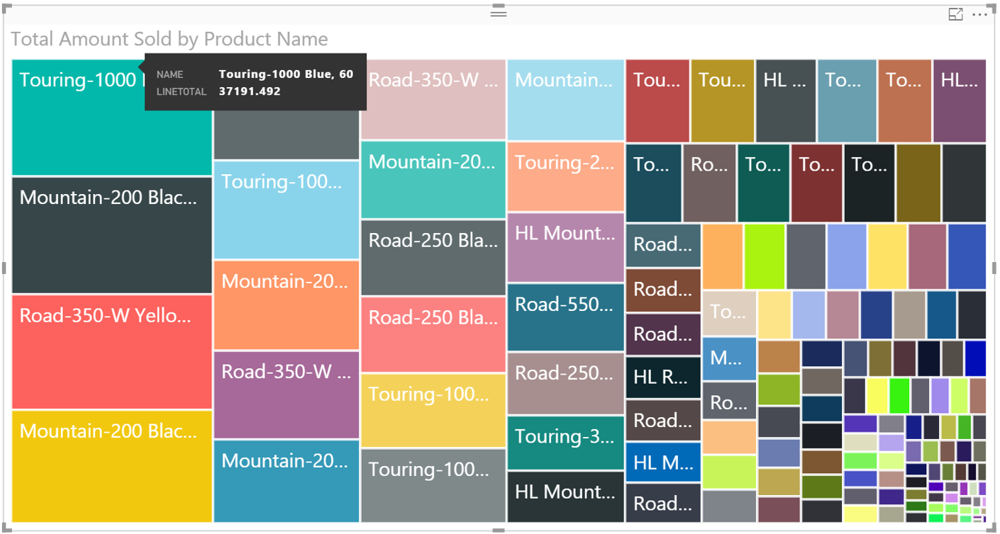
<br/><br/>
     1. _**Chart Showcasing Top Selling Product Categories**_

         1. Scroll to the &#39;**SalesOrderDetail**&#39; table and click the checkmark next to the &#39;**ProductID**&#39; field.

            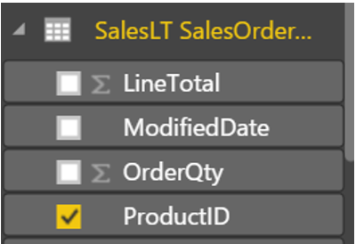

         1. From the &#39;**ProductCategory**&#39; table, select the &#39;**Name**&#39; field.

            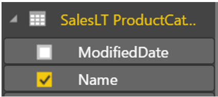

         1. From the visualizations section, pick the &#39;**Donut Chart**&#39;. Ensure that the &#39;**Name**&#39; column is situated in the &#39;**Legend**&#39; section and &#39;**ProductID**&#39; ( **count** ) in the &#39;**Values**&#39; section as shown below.

            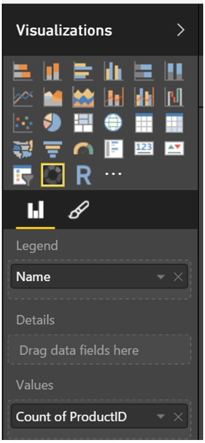

         1. You should see the chart as below:

            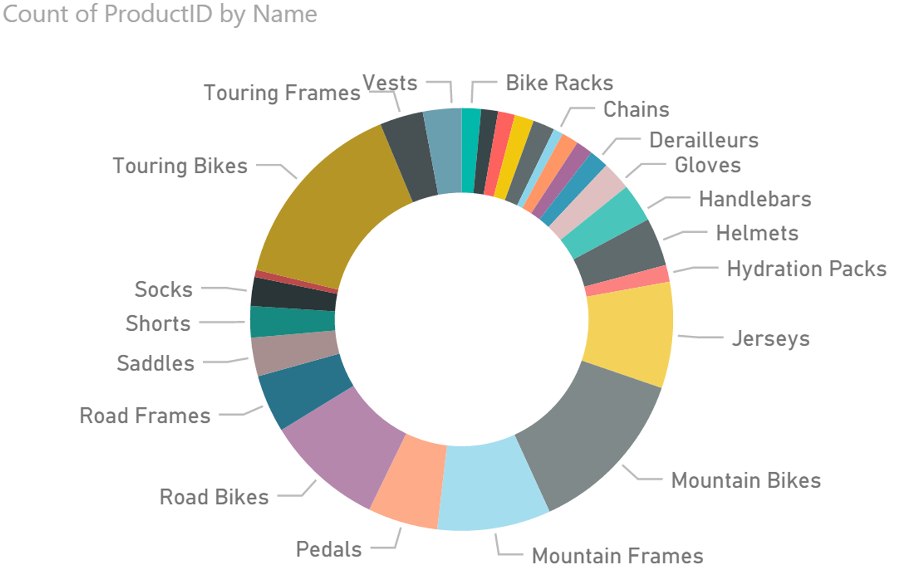
<br/><br/>
     1. _**Chart Showcasing Transaction Amount By Sales Order Number**_

         1. From the right pane, scroll to the &#39;**SalesOrderDetail**&#39; table and click the checkmark next to the &#39;**LineTotal**&#39; field.

  	        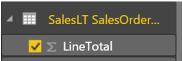

         1. From the same table, select the &#39;**SalesOrderID&#39;** field. We&#39;ll assume that we provide the Sales Order Number to our customers when they make a purchase on our website.

         	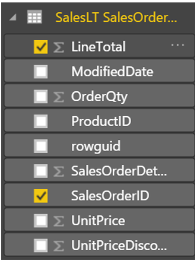

         1. From the visualization section, select &#39;**Clustered Column Chart**&#39; visual. Ensure that &#39;**SalesOrderID**&#39; is under the &#39;**Axis**&#39; section and the &#39;**LineTotal**&#39; is under the &#39;**Values**&#39; section.

        	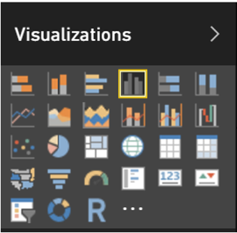

         1. The chart should show up as follows:

        	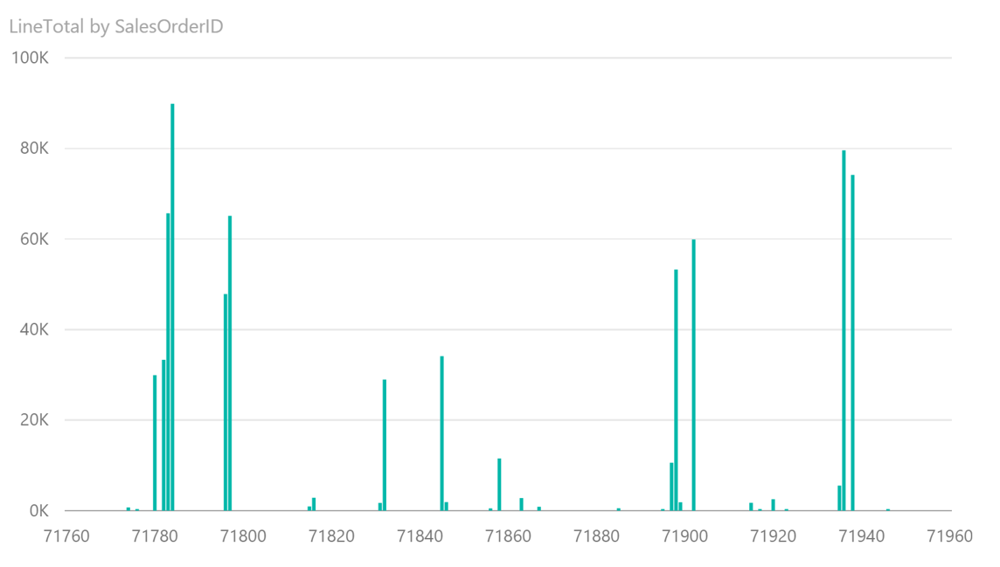

         Even though the chart doesn&#39;t look as fascinating upfront, once filtered per customer, it will add value to the customer.
<br/><br/><br/>

1. ###  **<a id='pbie-rls'>Adding Row-Level Security to the Power BI Report</a>**

     Now that our report has been created, we will start creating roles for our different customers so that they can see how much products they&#39;ve ordered. For this exercise, we will assume that all our customers have a &#39;adventure-works.com&#39; email domain.

     Since we&#39;re using the AdventureWorksDB that already has relationships created between users and sales data, we do not need to create additional relationships.

     1. Let&#39;s first verify that the relationships between our datasets are setup as expected. Within Power BI Desktop, click on the &#39;**Relationships**&#39; icon on the left pane.

  	    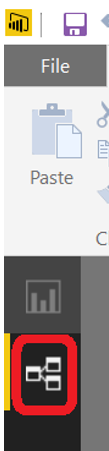

     1. Notice the relationship between the &#39;**SalesOrderDetail**&#39; table and the &#39;**Customer**&#39; table. We will filter our reports based on the customers that log in and only show the customers the data that pertains to them.

     	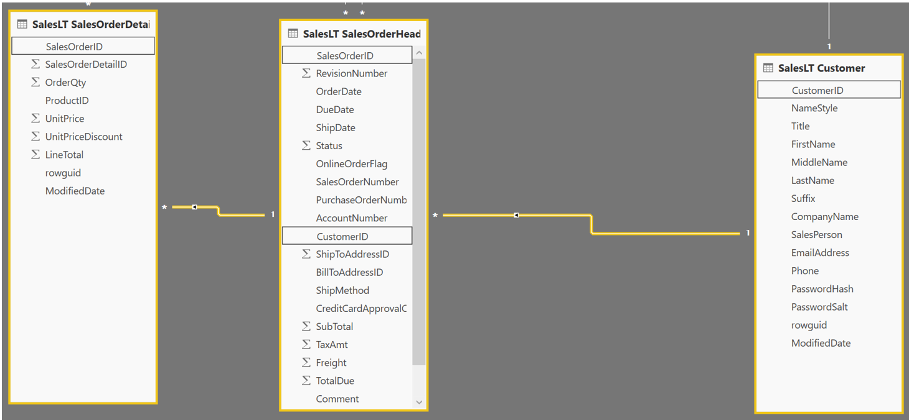

     1. This is what the &#39;**Customer**&#39; table looks like. We will set **EmailAddress** as the **username**.

    	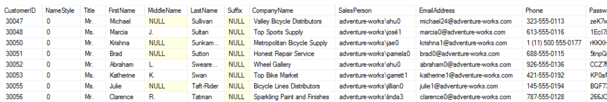

     1. Based on this schema, if we apply a filter to the **EmailAddress** column in the **Customer** table, and if that filter matches the user viewing the report, that filter will also filter down the **SalesOrderDetail** , **SalesOrderHeader** , **Product** and **ProductCategory** tables to only show data for that particular customer.

     1. On the Modeling tab, click **Manage Roles**.

    	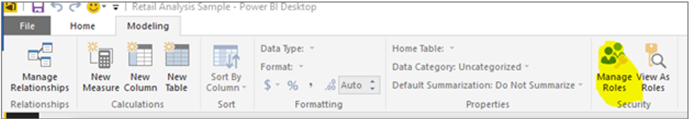

     1. Create a new role called **Customer**.
 
    	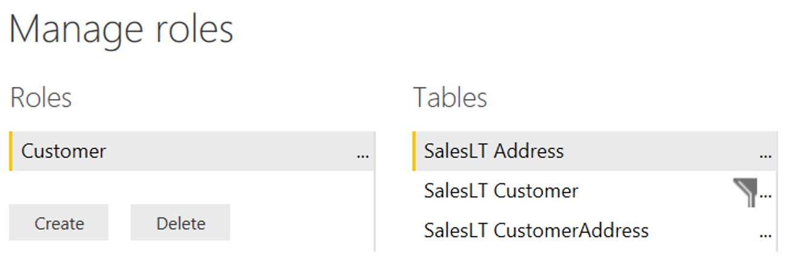

     1. In the **Customer** table enter the following DAX expression: **[EmailAddress] = USERNAME()**

    	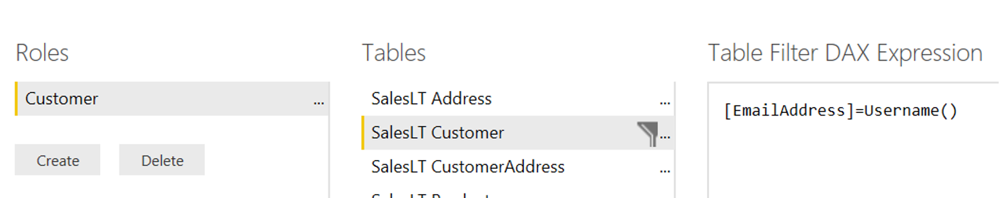

     1. To make sure the rules are working, on the **Modeling** tab, click **View as Roles** , and then enter the following:

    	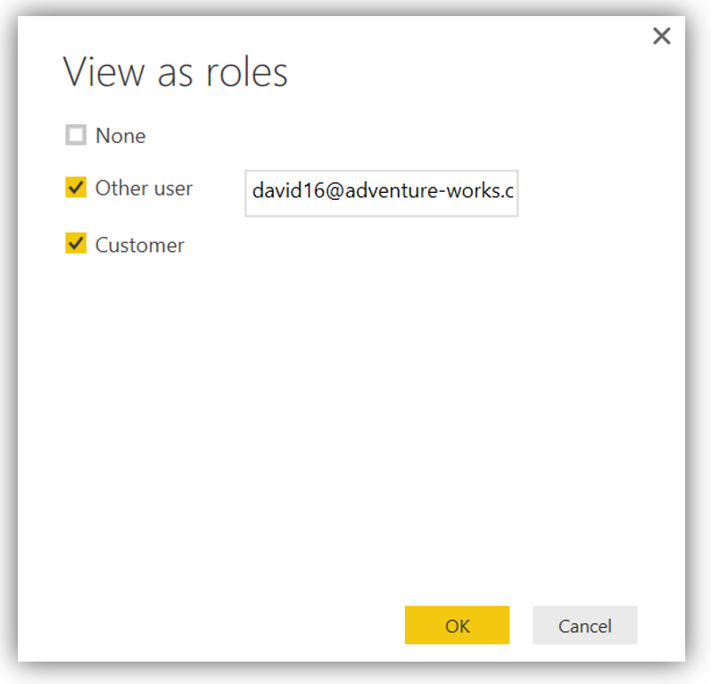

     The reports will now show data as if you were signed in as **&#39;david16@adventure-works.com&#39;**.

     At this point, you can save the report on your local computer and close PowerBI Desktop.
<br/><br/><br/>

1. ###  **<a id='upload-report'>Uploading Your Report to your PBIE Workspace</a>**

     1. Make your way over to the command prompt. The first thing to do is to create a Workspace. We will be doing so using the NodeJS SDK. To do so, please use the following command:

	    ``` powerbi create-workspace -c <collection> -k <accessKey> ```

        Please replace the &#39;**&lt;collection&gt;**&#39; with your Collection name and the &#39;**&lt;accessKey&gt;**&#39; with your Access Key. Your &#39;**Collection**&#39; and &#39;**AccessKey**&#39; can be found in the Azure portal under the Workspace Collection that you created in Step I.

        >**NOTE** : You can always explore the parameters needed to call a function by typing **'powerbi -h'** or **'powerbi &lt;functionName&gt; -h'**
  
        If successful, you should see the following result, with the Workspace ID. Please keep a note of the Workspace ID.

        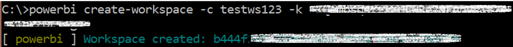

     1. To ensure that the workspace got created correctly, please run the following command. You should see your recently created Workspace ID in the list.
          
	    ``` powerbi get-workspaces -c <collection> -k <accessKey>  ```

           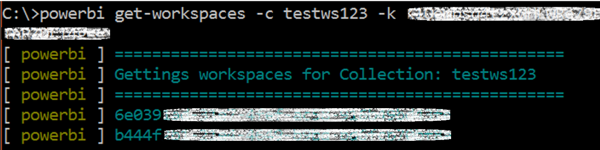

     1. Next, we will upload our report into the recently created Workspace ID. We will do so by running the following command (please replace the values of the variables with your specific values).

        ``` powerbi import -c <collection> -w <workspaceId>  -k <accessKey> -f <filePathAlongWithFileName> -n [nameForThePBIReport] -o [overwrite] ```
 
        >**NOTE** : If you are uploading the file for the first time, DO NOT include the overwrite flag.

           
 
     1. You can check if the report was successfully uploaded by running the following command:

        ``` powerbi get-reports -c <collection> -w <workspaceId>  -k <accessKey> ```

           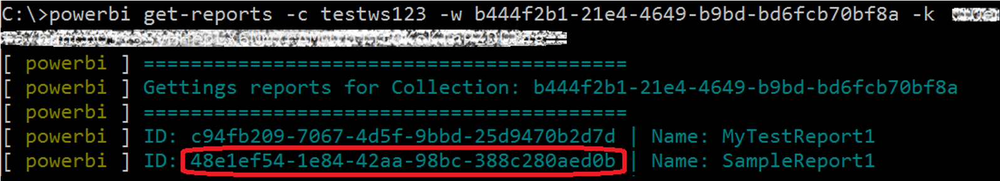

     1. Copy and save the **reportID** that you&#39;re trying to embed. You will need this Report ID later.

     1. When we upload our report, it does not upload the connection string with it. So, when using DirectQuery, you need to update the connection settings. First thing to do is to get the Dataset ID. When you uploaded your report, your dataset connection string got uploaded as well. To get your Dataset ID, you can run the following command:

		``` powerbi get-datasets -c <collection> -w <workspaceId>  -k <accessKey> ```

           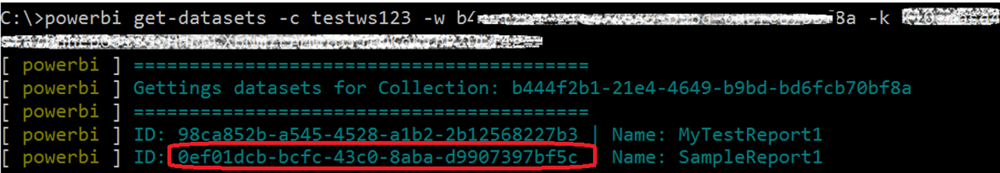

     1. Save the **DatasetID** corresponding to the report that you&#39;re trying to embed. You will need it in the next step.

     1. Next, we need to update the credentials for the database connections. The command looks like:

		``` powerbi update-connection -c <collection> -w <workspaceId> -d <datasetID> -u &lt;Admin username&gt; -p &lt;admin password&gt; -k <accessKey> ```

           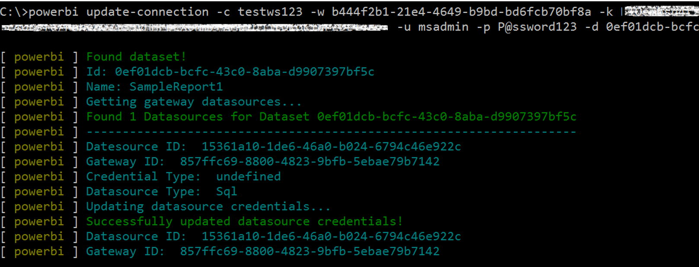

     With this, we have successfully uploaded our report to PowerBI Embedded. It is now time to embed our report into a web application.
<br/><br/><br/>
1. ###  **<a id='nodejs-sample-app'>NodeJS Sample Application</a>**

     For this exercise, we have already created a bare-bone web application using [NodeJS](https://nodejs.org/en/), [Express](http://expressjs.com/) &amp; [Pug](https://pugjs.org/api/getting-started.html) (Jade). We will use [Passport](http://passportjs.org/) for authentication and Pug/Jade for our front-end. We will create a sample NodeJS application from scratch and add in the required code to enable PowerBI Embedded reports on our web application. You can also find the finished product in the &#39;finish&#39; folder.

     1. **Setting up the Application**

         1. Let&#39;s first go to the command line and install express

               ``` npm install -g express-generator ```

         1. (Linux Only) You may find that you get a permissions error. If this is the case rerun the command with sudo.

                sudo npm install -g express-generator

            The -g flag means that you are installing express globally on your system.

         1. Now we can create an express application.

                express -c stylus pbie\_sample

            The -c states that we want to use stylus for css. You should see the following output:

				create : pbie\_sample
				
				create : pbie\_sample/package.json
				
				create : pbie\_sample/app.js
				
				create : pbie\_sample/public
				
				create : pbie\_sample/routes
				
				create : pbie\_sample/routes/index.js
				
				create : pbie\_sample/routes/users.js
				
				create : pbie\_sample/views
				
				create : pbie\_sample/views/index.jade
				
				create : pbie\_sample/views/layout.jade
				
				create : pbie\_sample/views/error.jade
				
				create : pbie\_sample/bin
				
				create : pbie\_sample/bin/www
				
				create : pbie\_sample/public/javascripts
				
				create : pbie\_sample/public/images
				
				create : pbie\_sample/public/stylesheets
				
				create : pbie\_sample/public/stylesheets/style.styl
				
				install dependencies:
				
				 $ cd pbie\_sample &amp;&amp; npm install
				
				run the app:
				
				 $ set DEBUG=pbie\_sample:\* &amp; npm star
				  	  
         1. As per the instructions in the output above, you will need to install dependencies so do this

				cd pbie\_sample &amp;&amp; npm install

            This will install packages and you will see a lot of output. When this is complete you can boot your application.

        		set DEBUG=pbie\_sample:\* &amp; npm start

            >**NOTE** : To help you easily deploy changes to your web app, you can also install &#39;**nodemon**&#39;.
 
         1. Once started, you should be able to navigate to [http://localhost:3000/](http://localhost:3000/) and view the sample web page.

            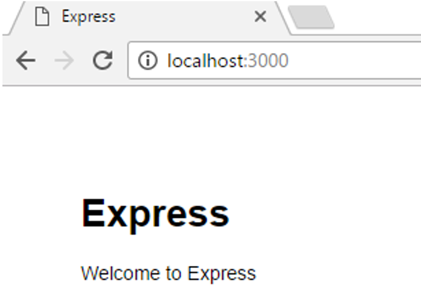 
<br/><br/>
     1. **Authentication**

         1. We&#39;ll add the authentication layer to this web app so that we can add row-level security. We will use the email addresses found in the &#39;**EmailAddress**&#39; column of the &#39;**Customer**&#39; table in the AdventureWorks database.

         1. Let&#39;s add passport.js and other dependencies to our application by typing the following command from the root directory of your application. The &#39;--save&#39; flag helps you save the package as a part of the package.json. This ensure that it is added as a dependency to your project.

				npm install passport --save
				npm install passport-local --save
				npm install express-session --save
				npm install connect-flash --save
				npm install tedious --save
				npm install ms-rest --save
				npm install powerbi-api --save
				npm install powerbi-client --save

         1. Here&#39;s what each of the above npm packages are used for:

            - [passport](http://passportjs.org/): This will be used for authentication of a user.
            - [passport-local](https://github.com/jaredhanson/passport-local): This is the authentication technique of passport.js that we will be using to perform the authentication. We use this authentication technique since we will use username and password to authenticate.
            - [express-session](https://github.com/expressjs/session): This will be used to do session handling when a user is logged in, since passport does not do session management for us.
            - [connect-flash](https://github.com/jaredhanson/connect-flash): This will be used to help us with error handling by providing flash messages which can be displayed to user on error.
            - [tedious](https://github.com/tediousjs/tedious): Tedious is an implementation of the [TDS protocol](http://msdn.microsoft.com/en-us/library/dd304523.aspx), which is used to interact with instances of Microsoft&#39;s SQL Server
            - [ms-rest](https://github.com/Azure/azure-sdk-for-node/tree/master/runtime/ms-rest): When communicating with Azure, this package helps us in serialization/deserialization, error handling, tracing, and http client pipeline configuration. Required by nodeJS client libraries generated using AutoRest.
            - [powerbi-api](https://github.com/Microsoft/PowerBI-Node): NodeJS SDK for Power BI Embedded
            - [powerbi-client](https://github.com/Microsoft/PowerBI-JavaScript): Client-side Javascript library for Power BI Embedded.

         1. You can open up package.json to ensure that all these package dependencies have been added to the file.

              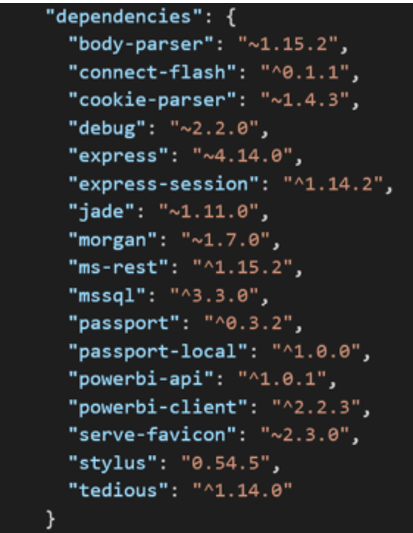

         1. Now, open app.js in the editor of your choice. Without going into too much details on how passport.js works, let&#39;s add in the authentication piece.
         
         1. We will only use one file to perform routing i.e **index.js**. Let&#39;s start by removing the other routing rule below.

			  ``` var users = require('/routes/users'); ```

         1. Now that we have removed one of the routing rules and only specified the one routing rule, let&#39;s add information on how to connect to our SQL DB. Before the line that initialized express i.e. var app = express();, let&#39;s add the following few lines. Do not forget to update the connection information in the config variable.

			```JavaScript
			var passport = require('passport');
			var LocalStrategy = require('passport-local').Strategy;
			var session = require('express-session');
			var flash = require('connect-flash');
			var Connection = require('tedious').Connection;
			var config = {
			userName: '<username>',
			password: '<password>',
			server: '<AzureSQLServer>.database.windows.net',
			options: {encrypt: true, database: 'AdventureWorksSampleDB', rowCollectionOnRequestCompletion: true}
			};
			
			var connection = new Connection(config);
			connection.on('connect', function(err){
			console.log('Connected to SQL DB')
			});
			```

         1. Next, let&#39;s add the authentication logic. Passport.js uses three main functions to perform authentication viz. **serializeUser** , **deserializeUser** &amp; **use**. After express() has been initialized, let&#39;s add in the three passport calls.
            >**NOTE** : We will not be checking for password authentication since this is a sample application and for the purposes of demonstration only.

			```JavaScript
			var Request = require('tedious').Request;
			var TYPES = require('tedious').TYPES;

			passport.use('local-login',new LocalStrategy({
				usernameField: 'username',
				passwordField: 'password',
				passReqToCallback: true,
				session: true
			},
			function(req, username, password, done){
				request = new Request("SELECT c.FirstName, c.LastName, c.CompanyName, c.EmailAddress AS username, c.PasswordHash, c.PasswordSalt FROM SalesLT.Customer AS c WHERE c.EmailAddress='"+username+"';", function(err, rowCount, rows){
				if(err){
					return done(err);
				}
				if(rowCount===0){
					return done(null, false, {message: 'Invalid Username or Password'});
				}
				return done(null, rows[0]);
					});
					connection.execSql(request);
					//Not checking for password correction since this is a sample. You can extend this application to check for password as well. The SQL query returns the password.
			}));


			passport.serializeUser(function(user, done) {
			done(null, user[3].value);
			});


			passport.deserializeUser(function(username, done) {
			request = new Request("SELECT c.FirstName, c.LastName, c.CompanyName, c.EmailAddress AS username, c.PasswordHash, c.PasswordSalt FROM SalesLT.Customer AS c WHERE c.EmailAddress='"+username+"';", function(err, rowCount, rows){
					if(err){
						return done(err);
					}
					if(rowCount===0){
						return done(null, false, {message:'User not found'});
					}
					done(null, rows[0]);
					});
					connection.execSql(request);
			});
			```

		1. Notice how we send a SQL query to check whether the user exists within our database. Now, this might not be the best practice for a production application (especially since we&#39;re using our reporting DB for authentication as well), but, it suffices for our demo application.

        1. Next, find the line that reads ``` use('/users', users); ``` and delete it since we will not have a users page in our sample application. You can also safely delete the **users.js** file found under the **routes** folder.

        1. Right above that line, let&#39;s add in session handling information. Since this is a demo application, we will be entering our secret key in the app.js itself. In a production application, the recommendation is to use something like [dotenv](https://github.com/motdotla/dotenv) to load your secret key into your application securely.

        1. Don&#39;t forget to replace the &#39;**secret**&#39; with a secret phrase.

			```JavaScript
					app.use(session({
					secret: '<someSecret>',
					key: 'sid',
					cookie: { secure: false },
					}));
					app.use(passport.initialize());
					app.use(passport.session());
					app.use(flash());

			```

          This is an example of what it should look like:

             
    <br/><br/>
     1. **Token Creation &amp; Routing**

         1. At this point, we have successfully added the smarts to our application to handle authentication and sessions. Next, let&#39;s create the routings and the Power BI Embedded token to render the report. Let&#39;s open the index.js file.

         1. At the top of the file, let&#39;s add references to the classes we&#39;ll need.

			```JavaScript
				var passport = require("passport");
				var powerbi = require("powerbi-api");
				var msrest = require("ms-rest");
			```

        1. Let&#39;s also add some variables to help us fetch the right report. We will be hard-coding these variables in the application for the purposes of this demo. You could easily use something like [dotenv](https://github.com/motdotla/dotenv) to load your variables into your application securely.

			```JavaScript
				var workspaceCollection = "<workspace collection name>";
				var appKey = "<power bi embedded app key>";
				var workspaceId = "<PBIE workspace ID>";
				var reportId = "<PBIE Report ID>";
			```

        1. Next, create a Power BI client so that we can communicate with the Power BI Embedded REST API. We&#39;ll do that by adding the following two lines of code.

			```JavaScript
				var credentials = new msrest.TokenCredentials(appKey, "AppKey");
				var client = new powerbi.PowerBIClient(credentials);
			```

        1. Before we jump into the fun part, let&#39;s wire up our routing. Let&#39;s replace the current routing with the following. This will help us route the client to the necessary page. Please read the comments in the code for more explanation.

            * _Remove This:_

			```JavaScript
				 /* GET home page. */
				router.get('/', function(req, res, next) {
				  res.render('index', { title: 'Express' });
				});
			```

            * _Add This:_

			```JavaScript
				/* Render the login page. */
				router.get('/login', function(req, res) {
				res.render('login', { title: 'PBIE Login', error: req.flash('error')[0] });
				});

				
				/*Render the Home page (Ensures the user is logged in) */
				router.get('/', function(req, res) {
					if(!req || !req.user){
						return res.redirect('/login');
					}
					//powerbi logic here
					res.render('index', { title: 'PBIE Sample - Home' });
				});


				
				/* Handles the Passport login functionality. */
				router.post('/login',
				passport.authenticate('local-login', {session: true, failureRedirect: '/login', failureFlash: true}),
				function(req, res){
					//console.log(req.user)
					res.redirect('/');
				});
				
				
				/* Logout the user, then redirect to the login page. */
				router.get('/logout', function(req, res) {
				req.logout();
				res.redirect('/login');
				});
			```

        1. Next, let&#39;s revisit the code where we check that the user is authenticated and redirect him/her to the home page and add in the code necessary to generate and sign our Power BI Access token and pass the details to the client to successfully embed the report. We&#39;ll add the code once the user has authenticated. This will help ensure that we don&#39;t generate access tokens for failed login attempts.

           The following is the code for creating the **embedToken** for a Power BI Embedded Report. We will replace the line of code that reads: res.render(&#39;index&#39;, { title: &#39;Express&#39; });

			```JavaScript
				var pbiReport = client.reports.getReports(workspaceCollection, workspaceId, function(err, result) {
				if(err) {
					throw err;
				}
				
				var token = powerbi.PowerBIToken.createReportEmbedToken(workspaceCollection, workspaceId, reportId, req.user[3].value, 'Customer');
				var jwt = token.generate(appKey);

				var rep = result.value.filter(function(report){
					return report.id === reportId;
				});
					
					var report = rep[0];
					res.render('index', 
						{ title: 'PBIE Sample - Home', 
							user: req.user,
							pbiReportDetails: {report, jwt}
						});
			});
			```

        1. As you can see, we use the Power BI Embedded NodeJS SDK and call the &#39;**createReportEmbedToken**&#39; method to generate the access token. By default, this access token is valid for 1 hour. However, we can change the validity of the token when creating it. You can learn more about creating an Access Toke [here](https://docs.microsoft.com/en-us/azure/power-bi-embedded/power-bi-embedded-app-token-flow). Once the token is generated, we sign it using the &#39;**appkey**&#39; and store it within the &#39;**jwt**&#39; variable. Finally, notice how we pass the variables to the front-end within the &#39;render&#39; function. We&#39;re passing in two important pieces of information to the front-end. First being the &#39;user&#39; object that holds details about our logged in user, such as his/her name. Second, we pass in a object we created called &#39;**pbiReportDetails**&#39;, which contains important information about our report, such as a **ReportID** and the **AccessToken**. Another approach to this can be creating an API endpoint and having the front-end call into the API endpoint. However, we will not be using that approach in our sample.

           This is what the final code looks like for the index page (&#39;/&#39;) route:

			```JavaScript
			//Render the Home page (Ensures the user is logged in)
			router.get('/', function(req, res) {
				if(!req || !req.user){
					return res.redirect('/login');
				}

				var pbiReport = client.reports.getReports(workspaceCollection, workspaceId, function(err, result) {
					if(err) {
						throw err;
					}
					
					var token = powerbi.PowerBIToken.createReportEmbedToken(workspaceCollection, workspaceId, reportId, req.user[3].value, 'Customer');
					var jwt = token.generate(appKey);

					var rep = result.value.filter(function(report){
						return report.id === reportId;
						});
						
					var report = rep[0];
					res.render('index', 
						{ title: 'PBIE Sample - Home', 
							user: req.user,
							pbiReportDetails: {report, jwt}
					});
				});
			});
			```

		<br/><br/>
     1. **Front-end**

         For the front-end, we will be using JADE (now known as PUG). Jade is a server-side HTML rendering engine. You can learn more about it [here](https://pugjs.org/api/getting-started.html).

         1. In the &#39;**Views**&#39; folder, open **layout.jade**. This will be our skeleton layout, which will be added to all the pages of our web app. Replace the content of layout.jade with the following code. 
		    >**Note**: Pug/Jade is very particular about the indentation, so, ensure that your code is indented correctly.

			```Pug
			doctype html
			html
			head
				title= title
				link(href='/stylesheets/bootstrap.min.css', rel='stylesheet')
				link(href='/stylesheets/style.css', rel='stylesheet')
			body
				.container
				.header
					ul.nav.nav-pills.pull-right
					li
						a(href='/') Home
					if user
						li
						a(href='/logout') Logout
					else
						li
						a(href='/login') Login
					h3.text-muted Power BI Embedded Sample Application
				block content
				script(src='/javascripts/jquery.min.js')
				script(src='/javascripts/bootstrap.min.js')

			```

        1. What we&#39;ve done here is added a &#39;**Login**&#39;, &#39;**Logout**&#39; and &#39;**Home**&#39; button. Additionally, we&#39;ve also added title text at the top of the page. Let&#39;s ensure our Javascript and css files are referenced correctly. You can download the files from here: [jquery.min.js](https://ajax.googleapis.com/ajax/libs/jquery/1.11.0/jquery.min.js) and [bootstrap.min.js &amp; bootstrap.min.css](https://github.com/twbs/bootstrap/releases/download/v3.3.7/bootstrap-3.3.7-dist.zip). Finally, replace the contents of the file style.css found within the &#39;public/stylesheets&#39; folder with the following:

			```css
				#welcome {
				margin-top: 6em;
				}

				#iFrameEmbedReport {
				height: 600px;
				}

				#welcome li {
				font-size: 1.5em;
				}

				.login, .logout {
				margin-top: 6em;
				}

				.container .h3 {
				text-align: center;
				}

				.login-fail {
				margin-bottom: 1em;
				}

				.login .last-p {
				margin-bottom: 2em;
				}

				.dashboard h2 {
				font-weight: bold;
				}

				.dashboard .data {
				color: #DF691A;
				font-weight: bold;
				}

				.jumbotron h1 {
				text-align: center;
				}

				.bigbutton {
				text-align: center;
				padding: 24px 48px;
				font-size: 24px;
				line-height: 1.33;
				border-radius: 0;
				}

				footer p {
				margin: 0em;
				padding: 0em;
				text-align: right !important;
				text-transform: uppercase !important;
				font-weight: 500 !important;
				font-family: "Helvetica Neue", Helvetica, Arial, "Lucida Grande", sans-serif !important;
				font-size: 13px !important;
				color: #fff !important;
				}

				footer p span {
				vertical-align: bottom !important;
				}

				footer p img {
				align: top !important;
				vertical-align: top !important;
				}

				footer p img.lock {
				align: bottom !important;
				vertical-align: middle !important;
				}
			```

        1. Now to add our login page. Within the &#39;**Views**&#39; folder, create file called as &#39;**login.jade**&#39; and add the following code in it. Note, we&#39;re using the twitter bootstrap login form template for this login form. It is a basic login form. We will not include advanced features such as &#39;Remember me&#39; and &#39;forgot your password&#39;. An important thing to note here is the first line of the login.jade file. It says &#39;extends layout&#39;. This ensures that layout.jade is used to render the skeleton page before adding the login specifics.

			```Pug
			extends layout
			block content

			.login
				.row
				.col-lg-6.col-lg-offset-3
					form.bs-example.form-horizontal(method='post',action='')
					fieldset
						legend Power BI Embedded Sample App - Login
						if error
							.alert.alert-dismissable.alert-danger.login-fail
							button.close(type='button',data-dismiss='alert')
							p.
							#{error}
						<br/>
						<br/>
						.form-group
							label.col-lg-4.control-label(for='username') Email
							.col-lg-4
							input#username.form-control(type='email', name='username', placeholder='Email', autofocus)
						.form-group
							label.col-lg-4.control-label(for='password') Password
							.col-lg-4
							input#password.form-control(type='password', name='password', placeholder='Password')
						.form-group
							.col-lg-10.col-lg-offset-4
							button.btn.btn-primary(type='submit') Login
			```

		1. Finally, let&#39;s create our home page experience and embed our report within the page. Open the index.jade file and add the following jade code to it.

			```Pug
			extends layout
			block content

			#welcome.jumbotron
				script(src='/javascripts/powerbi-client/dist/powerbi.js')
					
				h3 Hello <u><b>#{user[0].value}</b></u>, Welcome to Power BI Embedded NodeJS Sample Application
				p.lead.
				<br/>
				if error
				.alert.alert-dismissable.alert-danger.login-fail
					button.close(type='button',data-dismiss='alert')
					p.
					#{error}
				div#iFrameEmbedReport
			```

        1. As you can see, we&#39;ve created a div tag called &#39;**iFrameEmbedReport**&#39;. We will be using this div tag to embed our Power BI report within our page. We will add the following JavaScript code to embed the report. The code makes use of the Power BI Javascript SDK we added to our project previously. Notice that we&#39;re adding a reference of the SDK to our index.jade file. To correctly reference it, copy the folder &#39;**powerbi-client**&#39; found in the &#39;**node\_modules**&#39; folder and paste it within the &#39;**public/javascripts**&#39; folder. Here&#39;s the JS code that we will to the bottom of the index.jade file that will help us render the Power BI report within the div tag.

			```Pug
			script.
				var embedConfiguration = {
					type: 'report',
					accessToken: '!{pbiReportDetails.jwt}',
					id: '!{pbiReportDetails.report.id}',
					embedUrl: 'https://embedded.powerbi.com/appTokenReportEmbed'
				};

				
				var reportContainer = document.getElementById('iFrameEmbedReport');
				console.log(reportContainer);
				var report = powerbi.embed(reportContainer, embedConfiguration);

			```

        1. Within the JS code above, we&#39;re first creating a variable called &#39;embedConfiguration&#39;, which holds the details our Power BI report. It requires 2 pieces of important information. First being the Power BI **Report ID** and the second being the **Access Token**. It uses the variables we passed through our index.js file. Finally, we call the **powerbi.embed** function to embed the Power BI report within our application.

        1. With this, we have completed the code for the application. Let&#39;s save all the files and run the code using the following console command to see our website in action.
<br/><br/>

1. ###  **<a id='demo'>Demo</a>**

	1. From the command line, navigate to the root directory of **pbie_sample** and run the command ```npm install```. This should download all the dependencies needed for for the solution to run.

		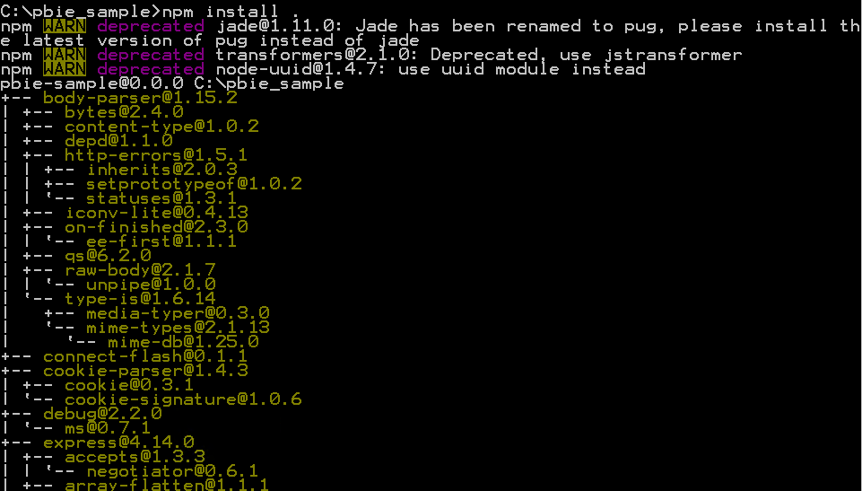

	1. Next, execute the command ```npm start``` from the root directory. This should start your web application.

		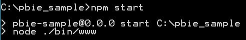

	1. Open a browser and navigate to http://localhost:3000/. You should automatically be redirected to the **Login** page.

		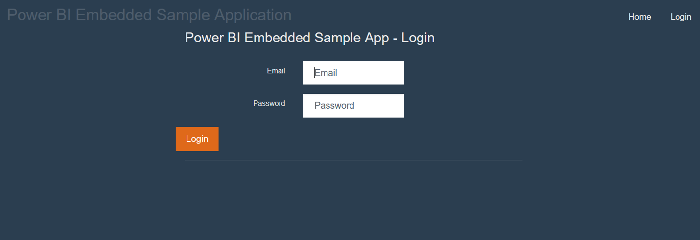

	1. Let&#39;s login using one of the invalid users. You should see the following error message, displayed using the [connect-flash](https://www.npmjs.com/package/connect-flash) module we added to our application.

		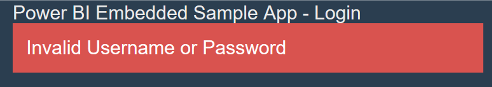

	1. Now, let&#39;s login using a valid user. You can connect to the Adventureworks database and pull down any user you want to login with. I will be using [david16@adventure-works.com](mailto:david16@adventure-works.com). Once logged in, I should see the Power BI report embedded within my application and filtered down for my user, _&#39;david16&#39;_. This is Power BI Embedded&#39;s [Row Level Security](https://docs.microsoft.com/en-us/azure/power-bi-embedded/power-bi-embedded-rls) in action. You can also notice a welcome message that is targeted for our user, David. This information is passed by our &#39;user&#39; object that we passed through index.js.

		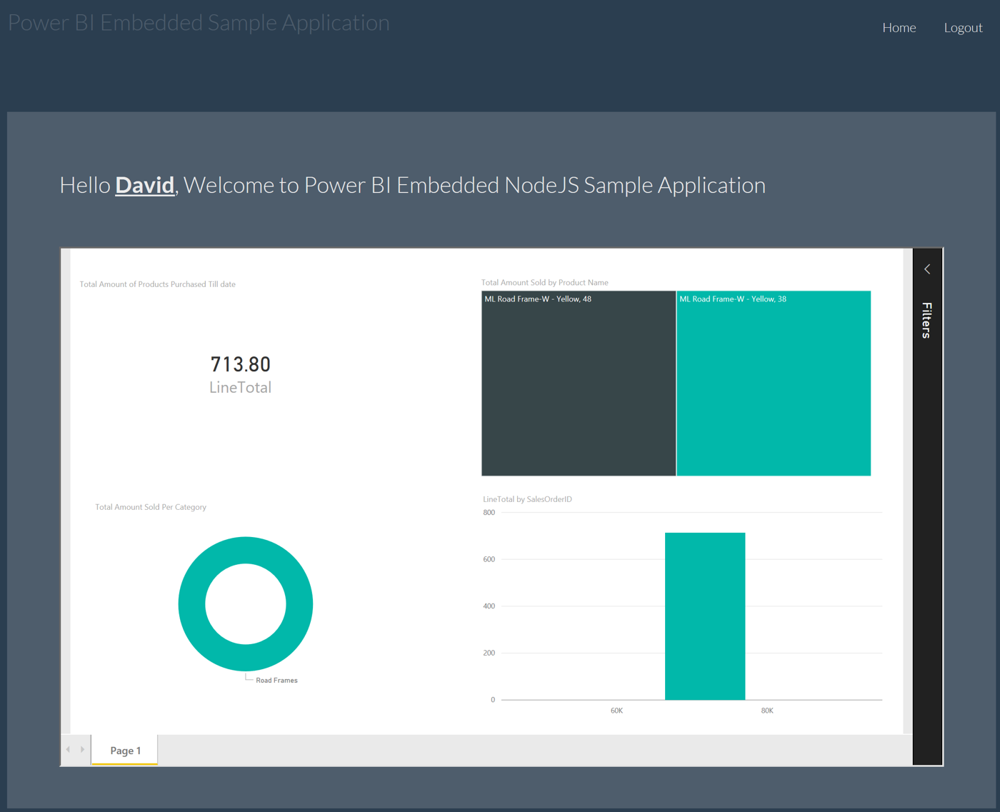

	1. Finally, let&#39;s ensure that the Row Level Security is working correctly. Let&#39;s log out and log back in as another user. This time, we&#39;ll use the email [andrea1@adventure-works.com](mailto:andrea1@adventure-works.com) to log in. You&#39;ll notice that the numbers are different, though the reports are the same. You can also notice how the two Power BI Reports have different data than the one we created in the Power BI desktop tool.

		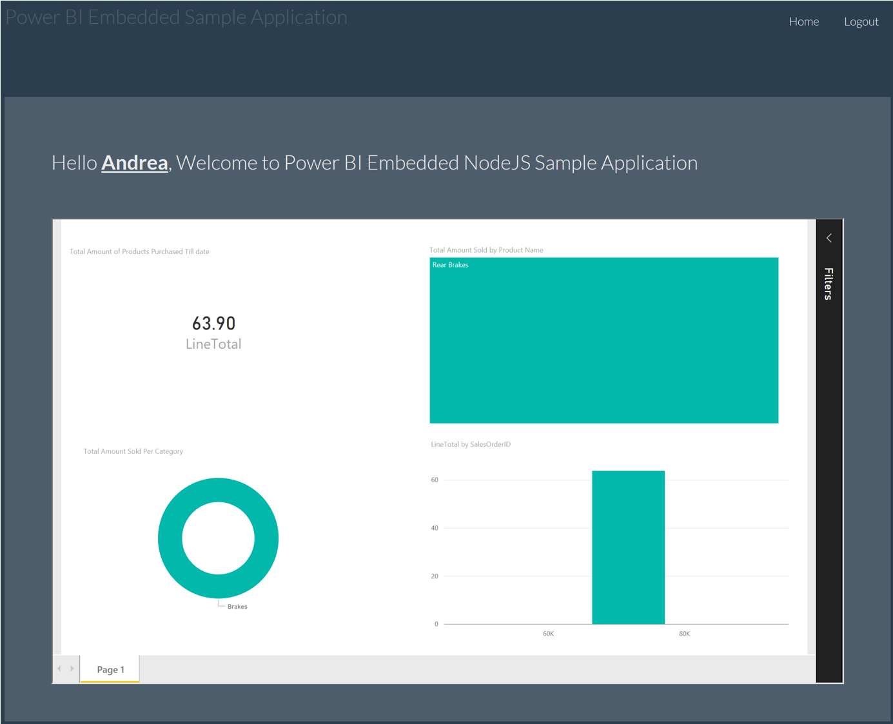


With that, we&#39;ve successfully created our first NodeJS based web application with a Power BI report embedded in it. The final solution can found in this repository.

